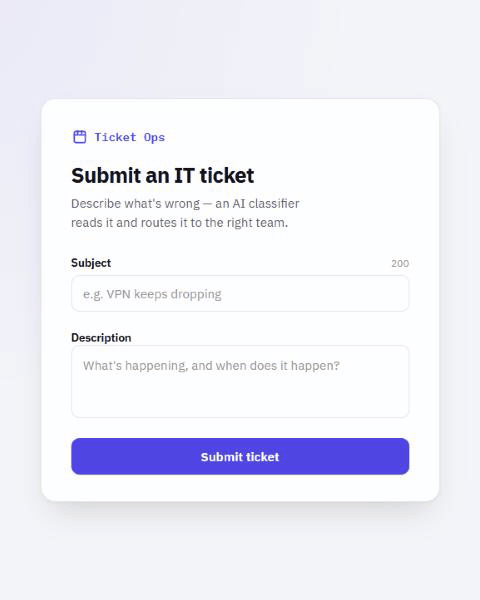
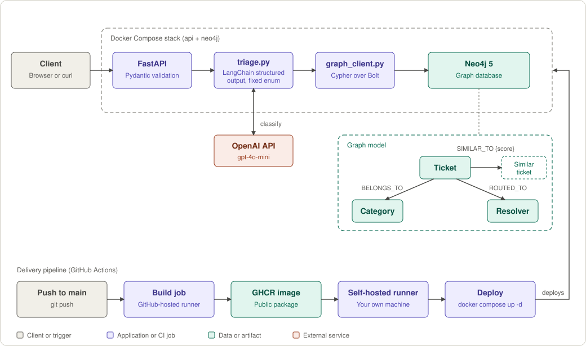
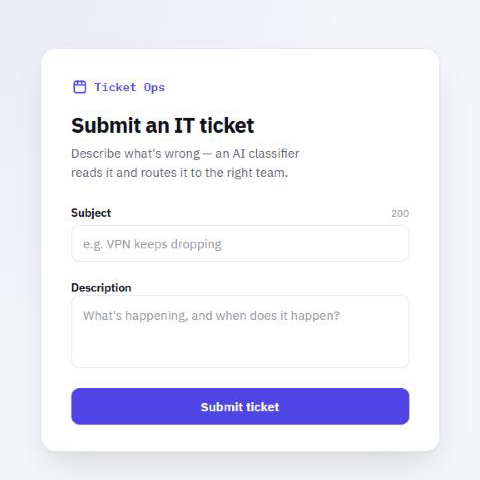
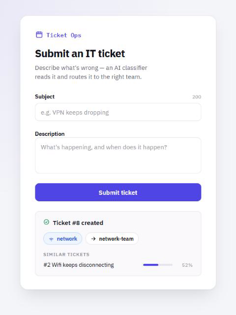
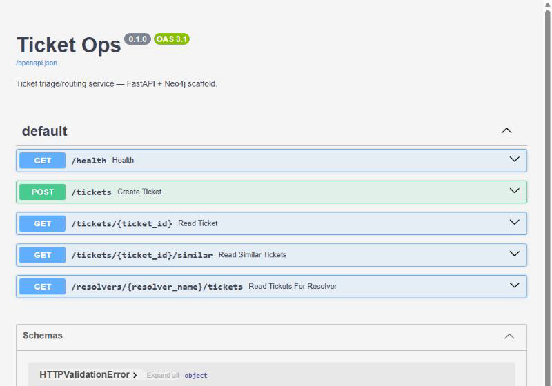

# Ticket Ops

Ticket Ops is an end-to-end AI-powered IT ticket triage service built with FastAPI, LangChain, OpenAI, and Neo4j. It classifies incoming IT issues into a controlled set of categories, deterministically routes them to support teams, stores ticket relationships in a graph, and surfaces similar historical tickets. It ships with a Docker Compose setup and a CI/CD pipeline that deploys to a self-hosted runner.

<p align="center">
  
</p>

## How it works



1. A ticket (subject + description) arrives at `POST /tickets`.
2. `app/triage.py` asks the model for a category and validates the answer against a fixed enum.
3. The category is mapped to a resolver queue with a plain dictionary lookup.
4. `app/graph_client.py` writes the ticket into Neo4j, links it to its category and resolver, and scores it against existing tickets in the same category to create `SIMILAR_TO` edges.
5. The response returns the ticket with its category, resolver, and timestamp.

## The LLM boundary

The model is probabilistic. The routing is not. The model's only job is to choose one value from a fixed list, and everything after that is deterministic code.

The model is called through LangChain with structured output (`gpt-4o-mini`, temperature 0), so its reply must parse into this schema or the call fails:

```json
{ "category": "network" }
```

The category enum and the routing table live in [`app/triage.py`](app/triage.py):

| Category | Routed to |
|---|---|
| `network` | `network-team` |
| `access` | `identity-team` |
| `hardware` | `hardware-team` |
| `productivity-apps` | `app-support-team` |
| `general` | `service-desk` |

Because the model can only return a member of the enum, it cannot invent a category or a team, and the same category always lands in the same queue. `general` is the fallback for tickets that fit nothing else, such as a question about expense policy.

## Features

- **Triage API** (`app/main.py`): FastAPI with Pydantic request validation. Endpoints: `POST /tickets`, `GET /tickets/{id}`, `GET /tickets/{id}/similar`, `GET /resolvers/{name}/tickets`, `GET /health`. Swagger UI at `/docs`.
- **Graph storage** (`app/graph_client.py`, `graph/`): tickets, categories, and resolvers as nodes, with relationships you can traverse. Uniqueness constraints in `graph/schema.cypher`, sample data in `graph/seed_data.cypher`, example queries in `graph/queries.cypher`.
- **Similar tickets**: a word-overlap (Jaccard) score against tickets in the same category, linked as `SIMILAR_TO` edges above a threshold. This is a deliberately simple stand-in for embedding similarity.
- **Archive ingest** (`scripts/ingest_archive.py`): bulk-loads a CSV export of historical tickets through the same classify-and-store pipeline the API uses. Extra legacy columns are ignored.
- **Frontend** (`app/static/index.html`): a single HTML/JS page served by FastAPI at `/`. Submit a ticket, see its category and resolver, and see similar tickets with their scores. No build step and no framework.
- **CI/CD** (`.github/workflows/deploy.yml`): builds a Docker image, pushes it to GitHub Container Registry, and deploys it with a self-hosted GitHub Actions runner.

## Screenshots

<table>
  <tr>
    <td align="center"><br>Submit a ticket</td>
    <td align="center"><br>Classified, routed, and matched</td>
  </tr>
  <tr>
    <td align="center" colspan="2"><br>Interactive API docs at <code>/docs</code></td>
  </tr>
</table>

## Run it locally

Requires Docker Desktop (or Docker plus Docker Compose).

```bash
cp .env.example .env   # then fill in OPENAI_API_KEY
docker compose up --build
```

This starts the FastAPI app on `http://localhost:8000` and Neo4j (browser UI at `http://localhost:7474`, credentials from `.env`).

Seed the graph with sample data:

```bash
docker compose exec -T neo4j cypher-shell -u neo4j -p changeme_password < graph/schema.cypher
docker compose exec -T neo4j cypher-shell -u neo4j -p changeme_password < graph/seed_data.cypher
```

Try it from the UI at `http://localhost:8000/`, or with curl:

```bash
curl -X POST http://localhost:8000/tickets -H "Content-Type: application/json" \
  -d '{"subject": "VPN keeps dropping", "description": "VPN disconnects every 10 minutes on Windows laptop"}'

curl http://localhost:8000/tickets/1
curl http://localhost:8000/tickets/1/similar
curl http://localhost:8000/resolvers/network-team/tickets
```

Ingest the sample archive export:

```bash
pip install -r requirements.txt
python -m scripts.ingest_archive data/archive/tickets.csv
```

Run the tests. They run against a live Neo4j and a real OpenAI key, with no mocks:

```bash
pip install -r requirements.txt
python -m pytest
```

## CI/CD

`deploy.yml` runs on every push to `main`:

1. **Build job** (GitHub-hosted runner): builds the Docker image and pushes it to `ghcr.io/dminish/opsticket/ticket-ops-api`.
2. **Deploy job** (self-hosted runner on your own machine): pulls that image and runs `docker compose pull api && docker compose up -d`.

The image is built once and the same artifact is deployed, on hardware you control rather than a PaaS.

Setup:

1. Repo Settings → Actions → Runners → New self-hosted runner. Follow the download and `config.cmd` steps GitHub shows, then start it with `run.cmd`. Docker Desktop must be installed and running on that machine.
2. Add the repository secret `OPENAI_API_KEY` under Settings → Secrets and variables → Actions.
3. Make the container package public (Packages → the package → Package settings → Change visibility), so the runner can pull it without credentials.
4. Stop any locally running stack first (`docker compose down`), because the deploy binds the same ports (8000, 7474, 7687).
5. Push to `main`, then seed the graph once (see "Run it locally").

The runner is started by hand, so it stops when the machine restarts. Start it again with `run.cmd`, or install it as a Windows service. To deploy to a remote VM instead, replace the deploy job with an SSH step (`appleboy/ssh-action`) that runs the same docker commands.

## Design decisions

**Why a graph database.** Routing is made of explicit relationships: ticket to category, ticket to resolver, ticket to similar ticket. In Neo4j these are named edges you can traverse, so a question like "which resolvers receive tickets similar to this one" is one pattern (`(t)-[:SIMILAR_TO]->(s)-[:ROUTED_TO]->(r)`) instead of chained joins. See `graph/queries.cypher`.

**Why not a vector index.** Vector search is the right tool for semantic similarity over free text. Here the structure (category, resolver, similarity edges) is the point. `SIMILAR_TO` is the one place the two ideas overlap, and swapping the word-overlap score for embedding similarity would be a contained change in `graph_client.py`.

**Why the model only picks a category.** Keeping routing out of the model makes behavior auditable and repeatable, and a bad completion can't send a ticket to a team that doesn't exist.

## Lessons learned

- A `bash` on the runner's PATH resolved to a WSL launcher stub with no distro attached, so deploy scripts died instantly. The deploy step now uses PowerShell, which is native on Windows runners.
- A container registry package is private by default, so the runner's pull was denied until the package was made public.
- A manual test stack was holding the ports the CI deploy needed. Two Docker Compose projects with different names can collide on host ports even though their containers are separate.
